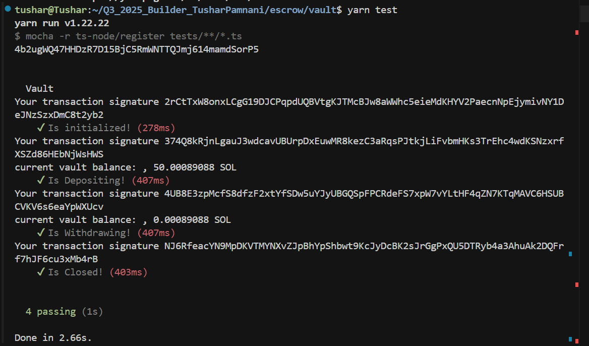

# Escrow (Vault) Solana Program

This project contains a Solana smart contract ("vault") written with [Anchor](https://book.anchor-lang.com/) and a suite of tests to demonstrate its usage. The vault program allows users to deposit, withdraw, and close a vault account securely on Solana.

## Directory Structure

- `vault/` — Anchor program source code (Rust)
- `vault/tests/` — Mocha/TypeScript tests for the program

## Prerequisites

- [Node.js](https://nodejs.org/) (v16+ recommended)
- [Yarn](https://yarnpkg.com/)
- [Solana CLI](https://docs.solana.com/cli/install-solana-cli-tools)
- [Anchor CLI](https://book.anchor-lang.com/getting_started/installation.html)

## Setup

1. **Install dependencies:**
   ```sh
   yarn install
   ```

2. **Configure your wallet:**
   - By default, tests use the wallet at `~/.config/solana/id.json`.
   - To use a different wallet, set the `ANCHOR_WALLET` environment variable:
     ```sh
     export ANCHOR_WALLET=/path/to/your/wallet.json
     ```

3. **Configure your cluster:**
   - By default, Anchor uses `localhost` (localnet). To use devnet or mainnet, set `ANCHOR_PROVIDER_URL`:
     ```sh
     export ANCHOR_PROVIDER_URL=https://api.devnet.solana.com
     ```

## Building and Deploying the Program

1. **Build the program:**
   ```sh
   cd vault
   anchor build
   ```

2. **Deploy the program:**
   ```sh
   anchor deploy
   ```
   - Make sure the program ID in `programs/vault/src/lib.rs` (`declare_id!`), `Anchor.toml`, and your tests all match.

## Running Tests

1. **Run the test suite:**
   ```sh
   cd vault
   yarn test
   ```
   - This will run all Mocha tests in `vault/tests/` using your configured wallet and cluster.

## Output of Tests



## Test Structure

- Tests are written in TypeScript using Mocha and Chai.
- Each test:
  - Initializes the vault for the user
  - Deposits SOL
  - Withdraws SOL
  - Closes the vault
- All errors and Anchor logs are printed for easier debugging.

## Troubleshooting

### DeclaredProgramIdMismatch Error
If you see:
```
AnchorError: ... Error Code: DeclaredProgramIdMismatch ...
```
- Ensure the program ID matches in all of:
  - `programs/vault/src/lib.rs` (`declare_id!`)
  - `Anchor.toml` under `[programs.localnet]` or `[programs.devnet]`
  - Your test code
- Run `anchor clean && anchor build && anchor deploy` to reset and redeploy.
- If using localnet, restart it with `anchor localnet`.

### Using Your Default Wallet
- By default, Anchor uses `~/.config/solana/id.json`.
- To use a different wallet, set `ANCHOR_WALLET` as above.
- Make sure you use the same wallet for both deploying and testing.

## Customization
- You can modify the vault logic in `vault/programs/vault/src/lib.rs`.
- Update or add tests in `vault/tests/test.ts`.

## References
- [Anchor Book](https://book.anchor-lang.com/)
- [Solana Docs](https://docs.solana.com/)

---

**Happy building on Solana!** 